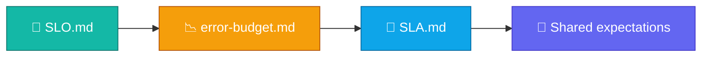

<p align="center">
  
</p>

<h1 align="center">sla-slo-templates</h1>

<p align="center">
  <strong>EN</strong> SLA, SLO, and error-budget documentation templates<br/>
  <strong>PT</strong> Templates de documentação SLA, SLO e error budget
</p>

<p align="center">
  <a href="https://github.com/manansbdb/sla-slo-templates/blob/main/LICENSE"></a>
  
  
  <a href="#support--apoio"></a>
</p>

---

## What it does / Para que serve

| English | Português |
|---------|-----------|
| Markdown templates for **SLA**, **SLO**, and **error budget** docs. | Templates Markdown para docs de **SLA**, **SLO** e **error budget**. |
| Fill with your service targets and review cadence. | Preenche com os targets do serviço e a cadência de review. |



---

## Install / Instalação

### 1) Clone / Clona

```bash
git clone https://github.com/manansbdb/sla-slo-templates.git
cd sla-slo-templates
```

### 2) Apply / Aplica

```bash
mkdir -p /path/to/your-project/docs/sre
cp templates/SLA.md /path/to/your-project/docs/sre/
cp templates/SLO.md /path/to/your-project/docs/sre/
cp templates/error-budget.md /path/to/your-project/docs/sre/
```

### Requirements / Requisitos

- `git`
- No runtime dependencies

---

## Quick start / Início rápido

```bash
git clone https://github.com/manansbdb/sla-slo-templates.git
cp sla-slo-templates/templates/SLO.md ./docs/sre/SLO.md
```

---

## Contents / Conteúdos

| Path | Purpose / Função |
|------|------------------|
| `templates/SLA.md` | Service level agreement |
| `templates/SLO.md` | Service level objectives |
| `templates/error-budget.md` | Error budget policy |
| `SUPPORT.md` | Donations / Doações |

---

## Project layout / Estrutura

```text
sla-slo-templates/
├── docs/banner.svg
├── templates/SLA.md
├── templates/SLO.md
├── templates/error-budget.md
├── SUPPORT.md
└── README.md
```

---

## Support / Apoio

Bitcoin donations welcome / Doações em Bitcoin bem-vindas:

```
bc1q0qfnlnxyum9u45stzxe0a7jnhtj4j0usfkqdjw
```

See [SUPPORT.md](./SUPPORT.md).

---

## License / Licença

[MIT](./LICENSE) © 2026 manansbdb
